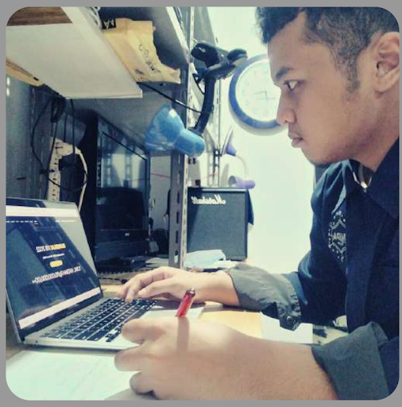

# Panduan Physics Olympiad EUREKA! ITB 2024

## BAB I: Objektif Lomba

### A. Pendahuluan

Olimpiade Fisika EUREKA! ITB adalah salah satu cabang kompetisi dari rangkaian acara utama EUREKA! ITB 2024. Kompetisi ini merupakan kompetisi berbasis olimpiade yang diselenggarakan bagi pelajar tingkat SMA/MA/Sederajat dan Perguruan Tinggi tingkat S-1/D-4/Sederajat dalam lingkup nasional. Kompetisi ini bertujuan mengasah kemampuan komprehensif peserta dalam bidang fisika, serta kemampuan berpikir kritis, analitik, dan kreatif dalam menyelesaikan masalah-masalah fisika yang diberikan saat kompetisi berlangsung.

### B. Tema

Tema yang diangkat dalam Olimpiade EUREKA! ITB 2024 ini sejalan dengan tema utama, yaitu “Problem-Solving Throughout The Physics Multiverse”. Tema ini menjelaskan mengenai berbagai universe yang berbeda antara satu sama lain, yang dikaitkan dengan cabang ilmu fisika, kemudian keseluruhannya membentuk satu multiverse. Cabang-cabang ilmu fisika tersebut berkaitan dengan Kelompok Keilmuan (KK) yang ada di Fisika ITB, antara lain sebagai berikut.

1. Fisika Teoritik Energi Tinggi
2. Fisika Magnetik dan Fotonik
3. Fisika Teknologi dan Material Maju
4. Fisika Nuklir dan Biofisika
5. Fisika Bumi dan Sistem Kompleks
6. Fisika Instrumentasi dan Komputasi

### C. Silabus Tingkat SMA/MA/Sederajat

1. Kinematika
2. Dinamika Partikel
3. Dinamika Benda Tegar
4. Osilasi
5. Gravitasi
6. Listrik Magnet
7. Termodinamika

### D. Silabus Tingkat Perguruan Tinggi

1. Mekanika Klasik
2. Listrik Magnet
3. Termodinamika dan Fisika Statistik
4. Gelombang dan Optika
5. Fisika Modern
6. Fisika Kuantum
7. Mekanika Fluida

## BAB II: Ketentuan Umum

### A. Aturan Umum

1. Proses seleksi dibagi menjadi tiga tahap yaitu babak penyisihan, babak semifinal, dan final.
2. Pelaksanaan Olimpiade dilakukan secara daring  untuk babak penyisihan, serta luring untuk babak semifinal dan final.
3. Peserta wajib menandatangani [Surat Pernyataan Pendaftaran Physics Olympiad EUREKA! ITB 2024](https://docs.google.com/document/d/1WBFWkXVpl7CvJI2PaxyeDfgxRh3X39cL/edit) dan diunggah pada proses pendaftaran.
4. Peserta Olimpiade tingkat SMA/MA sederajat harus merupakan siswa/i aktif yang dibuktikan dengan kartu tanda pelajar atau dokumen lain yang berlaku seperti surat keterangan dari pihak sekolah yang dilengkapi dengan tanda tangan kepala/cap dari sekolah terkait. Panitia EUREKA! ITB 2024 tidak diperbolehkan menjadi peserta.
5. Peserta Olimpiade tingkat Perguruan Tinggi merupakan mahasiswa/i aktif semester satu hingga delapan dan belum diwisuda ketika pendaftaran yang dibuktikan dengan kartu tanda mahasiswa atau dokumen lain yang masih berlaku atau pun surat keterangan yang memiliki cap/tandatangan dari Program Studi/Fakultas terkait. Panitia EUREKA! ITB 2024 tidak diperbolehkan menjadi peserta.
6. Perlombaan dilaksanakan secara individu.
7. Peserta boleh didampingi oleh satu guru atau dosen pembimbing.
8. Peserta wajib mendaftarkan diri pada [Dashboard EUREKA! ITB 2024](https://dashboard.eurekaitb.com).
9. Selama proses seleksi penyisihan dan seleksi semifinal berlangsung, peserta wajib menggunakan 2 (dua gawai). Gawai pertama berfungsi sebagai perangkat untuk mengerjakan soal, sedangkan gawai kedua berfungsi sebagai kamera yang akan dihubungkan ke Room Pengawasan Zoom Meeting selama pengawasan oleh penyelenggara dengan sudut penglihatan atau _angle view_ yang dapat memperlihatkan tangan, gawai pertama, dan wajah peserta dari samping. Ada pun jenis gawai yang dipakai dibebaskan kepada para peserta. Berikut contoh _point of view_ untuk gawai kedua.  

10. Peserta dilarang melakukan seleksi penyisihan
    secara kolektif di ruangan yang sama dengan peserta lain ketika babak penyisihan
    yang dilakukan secara daring, baik dalam satu instansi maupun instansi yang
    berbeda.
11. Peserta wajib memahami dan mengikuti aturan dan ketentuan lomba
    sesuai dengan yang telah ditentukan oleh penyelenggara EUREKA! ITB 2024.
12. Panitia berhak melakukan perubahan terhadap seluruh atau sebagian isi dalam
    _rulebook_ sewaktu-waktu. Segala perubahan akan diinformasikan melalui laman web
    EUREKA! ITB 2024, media sosial EUREKA! ITB 2024, atau ketika _technical
    meeting_.

### B. Tata Cara Pendaftaran

1. Calon peserta membuat akun pada [Dashboard EUREKA! ITB 2024](https://dashboard.eurekaitb.com) dengan mengisi data diri berupa nama, institusi asal, tingkat (SMA atau Perguruan Tinggi), NISN/NIM, dan alamat email serta membuat password akun.
2. Setelah peserta berhasil membuat akun dan login, calon peserta dapat melakukan pendaftaran lomba pada dashboard.
3. Pada menu pendaftaran lomba, calon peserta memilih cabang lomba `Physics Olympiad` kemudian melengkapi data berikut untuk keperluan verifikasi dokumen.

   - nama guru/dosen pembimbing (berada dalam satu instansi yang sama)
   - alamat email guru/dosen pembimbing
   - foto diri
   - foto kartu pelajar/kartu tanda mahasiswa atau surat keterangan aktif sebagai siswa/mahasiwa
   - [surat pernyataan pendaftaran](https://docs.google.com/document/d/1WBFWkXVpl7CvJI2PaxyeDfgxRh3X39cL/edit?usp=drive_link)
   - link posting [twibbon EUREKA! ITB 2024](https://linktr.ee/twibboneurekaitb24) dengan ketentuan akun instagram bersifat publik

4. Setelah melakukan pendaftaran lomba, calon peserta melakukan pembayaran biaya registrasi pada menu pembayaran dan wajib mengunggah **bukti pembayaran** pada menu tersebut untuk keperluan verifikasi oleh panitia.
5. Pada tahap ini proses pendaftaran lomba `Physics Olympiad` telah selesai. Calon peserta akan diminta untuk menggunggah ulang dokumen apabila ditemukan dokumen yang tidak valid.
6. Status `calon peserta` berubah menjadi `peserta` apabila dokumen dan pembayaran telah diverifikasi oleh panitia.

## BAB III: Sistem dan Ketentuan Lomba

### A. Gambaran Umum

1. Perlombaan terdiri dari tiga babak yang meliputi babak penyisihan, babak semifinal, dan final.
2. Tahap penyisihan dilakukan secara daring melalui laman web EUREKA! ITB 2024. Media tambahan lain yang akan digunakan selama proses perlombaan selain laman web akan diinfokan lebih lanjut oleh panitia.
3. Tahap semifinal dan final dilakukan secara luring berlokasi di Kampus Ganesha Institut Teknologi Bandung (ITB).
4. Jumlah peserta untuk setiap babak baik tingkat SMA/MA sederajat maupun mahasiswa sarjana/sederajat adalah sebagai berikut.
   - Babak Semifinal: 25 peserta
   - Babak Final: 10 peserta
5. Seluruh peserta akan dan berhak memperoleh sertifikat keikutsertaan dalam perlombaan Physics Olympiad EUREKA! ITB 2024.

### B. Tahap Penyisihan

1. Tahapan paling awal dari rangkaian seleksi Olimpiade bagi peserta yang sudah terdaftar adalah babak penyisihan.
2. Pada babak penyisihan peserta akan mengerjakan soal berupa pilihan ganda dan isian singkat secara daring dan individu.
3. Untuk tingkat SMA/MA/Sederajat, soal terdiri dari 30 soal pilihan ganda, dan 10 soal isian singkat.
4. Untuk tingkat Perguruan Tinggi, soal terdiri dari 20 soal pilihan ganda dan 10 soal isian singkat.
5. Soal dibedakan menjadi tiga tingkat kesulitan: Level 1, Level 2, dan Level 3.
6. Sistem penilaian yang digunakan untuk kedua jenjang adalah sebagai berikut.

| **Tingkat Kesulitan** | **Benar** | **Salah** | **Tidak Menjawab** |
| :-------------------: | --------: | --------: | -----------------: |
|        Level 1        |        +2 |        -1 |                  0 |
|        Level 2        |        +4 |        -2 |                  0 |
|        Level 3        |        +6 |        -3 |                  0 |

7. Pengerjaan akan dilakukan menggunakan laman web EUREKA! ITB 2024.
8. Proses pengerjaan pada babak penyisihan berlangsung selama 2 jam (120 menit), dengan waktu menyesuaikan dengan waktu server. Setelah waktu pengerjaan selesai, soal akan otomatis terkunci dan peserta tidak bisa mengerjakan atau mengganti jawabannya lagi. Jawaban peserta akan otomatis tersimpan pada database server.
9. Peserta yang terlambat log-in pada akunnya, tetap bisa mengerjakan soal selama waktunya belum habis namun tidak mendapatkan tambahan waktu dengan alasan apapun.
10. Peserta wajib mengerjakan soal secara individu tanpa bantuan dari pihak manapun. Peserta juga dapat berpindah-pindah dari soal satu ke soal lain secara bebas.
11. Selama pengerjaan soal, peserta wajib hadir ke dalam online conference menggunakan Zoom yang tautannya akan diberikan oleh panitia melalui akun masing-masing peserta. Peserta yang telah masuk ke dalam Zoom _meeting_ harus menyalakan kameranya untuk pengawasan oleh panitia.
12. Panitia juga akan mencatat kehadiran peserta melalui Zoom _meeting_ selama pengerjaan berlangsung.
13. Peserta yang tidak masuk ke dalam Zoom _meeting_ atau tidak menyalakan kamera selama pengerjaan berlangsung, maka tidak akan dianggap hadir oleh panitia dan akan otomatis didiskualifikasi.
14. Kendala-kendala seperti pemadaman listrik, dan kendala jaringan harus diantisipasi oleh peserta karena panitia tidak akan memberikan toleransi dalam bentuk apapun.
15. Daftar peserta yang lolos ke babak semifinal dan nilai peserta akan diumumkan melalui laman web dan media sosial EUREKA! ITB.
16. Aturan-aturan tambahan yang belum tercantum akan disampaikan oleh panitia saat _technical meeting_ sebelum babak penyisihan dimulai.
17. Peserta yang tidak mengikuti _technical meeting_ dianggap telah mengerti dan menyetujui aturan yang berlaku.

### C. Tahap Semifinal

1. Peserta yang dinyatakan lolos seleksi penyisihan berhak mengikuti seleksi semifinal.
2. Pada tahap ini peserta akan mengerjakan soal dalam bentuk esai secara luring dan individu.
3. Soal ujian untuk tingkat SMA maupun tingkat Perguruan Tinggi terdiri dari 6 (enam) soal esai.
4. Sistem penilaian pada babak semifinal tidak diperinci namun tiap soal memiliki poin yang berbeda-beda, bergantung pada tingkat kesulitannya. Poin maksimal tiap soal dan poin sub bagian soal tercantum pada tiap soalnya.
5. Peserta mengerjakan soal menggunakan kertas HVS berukuran A4 dengan pena berwarna hitam atau biru.
6. Pada setiap lembar jawaban, peserta diwajibkan mencantumkan identitas berupa nomor peserta semifinal pada pojok kanan atas lembar jawaban. Nomor peserta semifinal akan diberikan menjelang seleksi babak semifinal berlangsung. Peserta dilarang keras menuliskan asal instansi ataupun nama peserta pada lembar jawaban.
7. Peserta diwajibkan tidak mencampur jawaban satu soal dengan jawaban soal lain. Jika ingin berganti nomor soal, silakan memulai di lembar yang baru.
8. Proses pengerjaan pada babak semifinal berlangsung selama 3 jam (180 menit).
9. Peserta wajib mengerjakan soal ujian secara individu tanpa bantuan dari pihak manapun.
10. Peserta dimohon datang ke ruangan yang telah ditentukan sebelum waktu pengerjaan dimulai. Keterlambatan tidak akan diberikan tambahan waktu.
11. Daftar peserta yang lolos ke babak final dan nilai peserta akan diumumkan melalui laman web dan media sosial EUREKA! ITB.
12. Aturan-aturan tambahan yang belum tercantum akan disampaikan oleh panitia saat _technical meeting_ sebelum babak penyisihan dimulai.
13. Peserta yang tidak mengikuti _technical meeting_ dianggap telah mengerti dan menyetujui aturan yang berlaku.

### D. Tahap Final

1. Peserta yang berhak mengikuti babak final adalah peserta yang dinyatakan lolos seleksi babak semifinal.
2. Pada tahap ini peserta akan diberikan soal berupa open problem oleh dewan juri.
3. Peserta diminta menyelesaikan soal kemudian dibuat dalam bahan presentasi (dapat berupa file .pptx) yang berisi hasil analisis yang telah dilakukan untuk dipresentasikan kepada dewan juri.
4. Peserta diperbolehkan membuat coret-coretan dalam bentuk apa pun (kertas, file .docx, dll.).
5. Bahan presentasi yang telah dibuat dan coret-coretan wajib dikumpulkan semua ke [Dashboard EUREKA! ITB 2024](https://dashboard.eurekaitb.com).
6. Selama pengerjaan, peserta diwajibkan mengerjakan secara individu dan diperbolehkan untuk menggunakan referensi eksternal. Peserta diwajibkan untuk mencantumkan seluruh sumber referensi yang digunakan.
7. Referensi yang digunakan diperbolehkan berasal dari buku, artikel jurnal ilmiah, maupun laman web yang kredibel. Dilarang mengambil referensi dari laman web seperti Wikipedia, Blogspot, atau Wordpress.
8. Peserta dilarang keras menggunakan kecerdasan buatan seperti ChatGPT atau sejenisnya. Bila peserta didapati menggunakan kecerdasan buatan, maka peserta akan langsung didiskualifikasi.
9. Lama waktu pengerjaan dan presentasi akan diberitahukan saat _technical meeting_ babak final.
10. Aturan-aturan tambahan yang belum tercantum akan disampaikan oleh panitia saat _technical meeting_ sebelum babak penyisihan dimulai.
11. Peserta yang tidak mengikuti _technical meeting_ dianggap telah mengerti dan menyetujui aturan yang berlaku.

## Lampiran

- [Template Surat Pernyataan Pendaftaran Physics Olympiad](https://docs.google.com/document/d/1WBFWkXVpl7CvJI2PaxyeDfgxRh3X39cL/edit?usp=drive_link)  
- [Template Twibbon EUREKA! ITB 2024](https://linktr.ee/twibboneurekaitb24)
